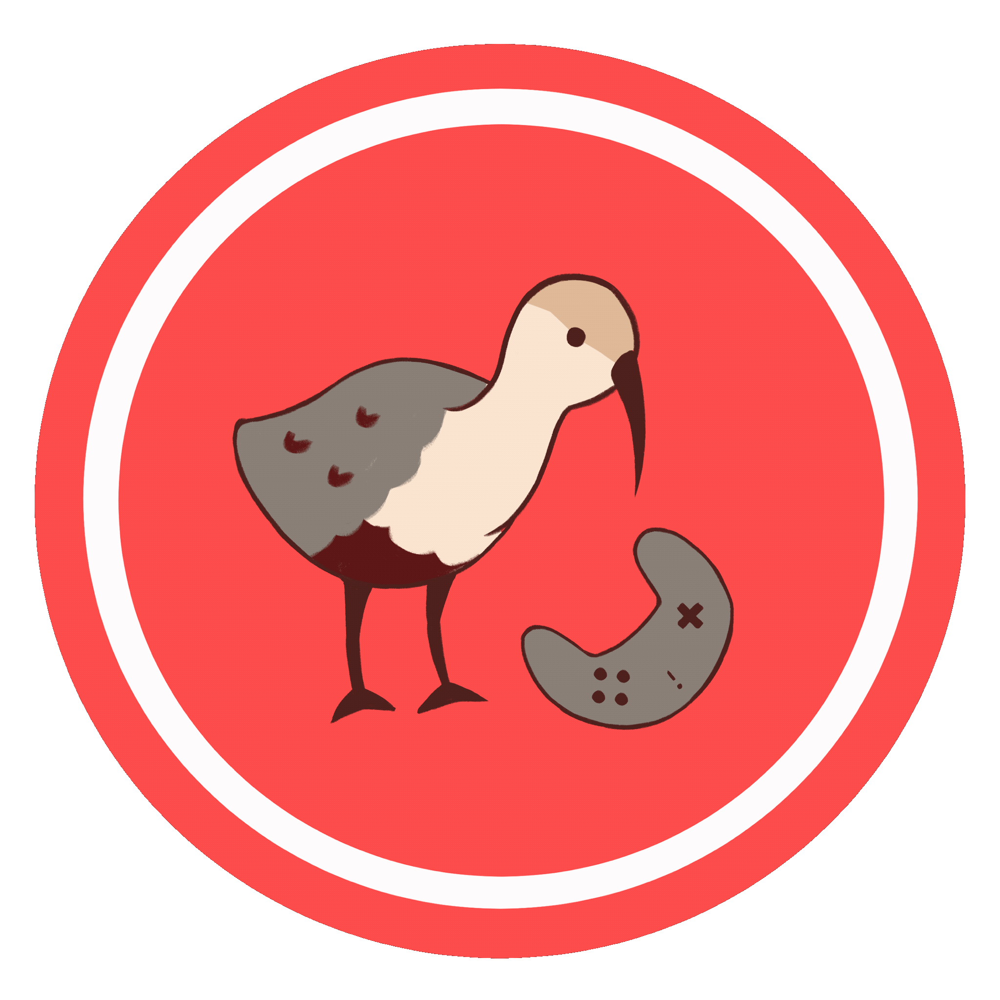
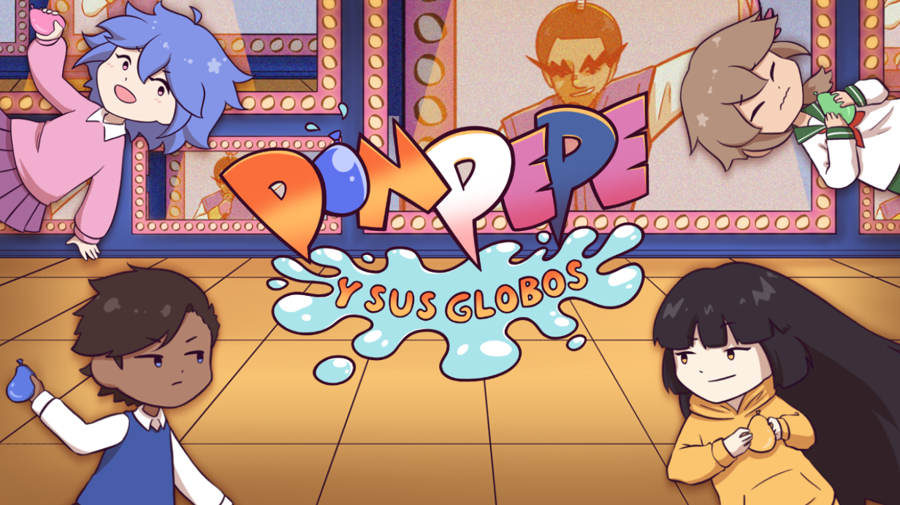
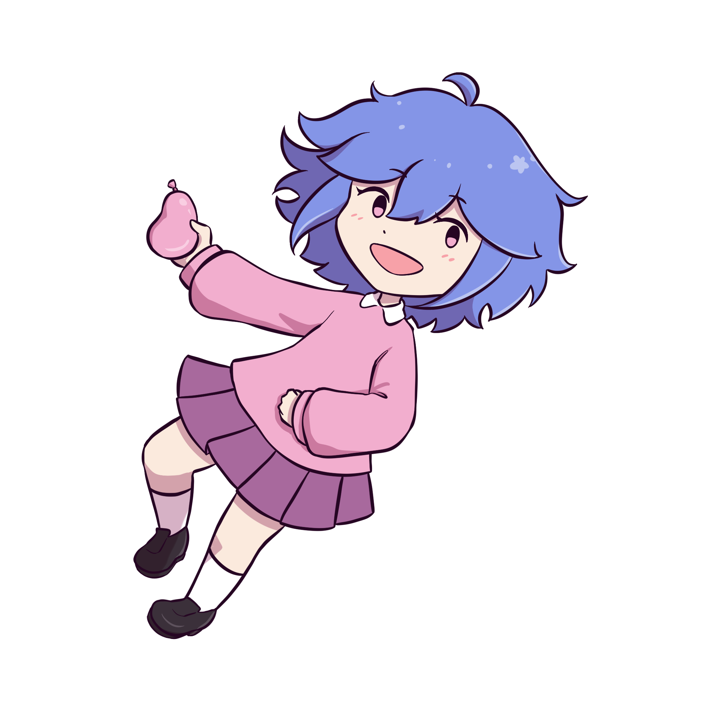
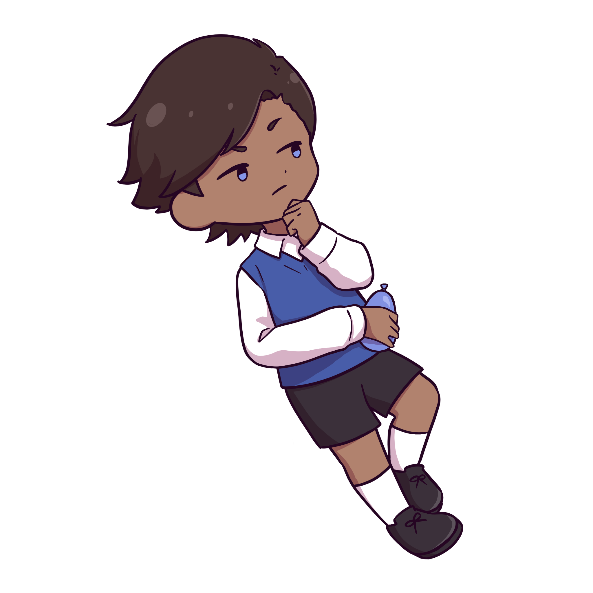
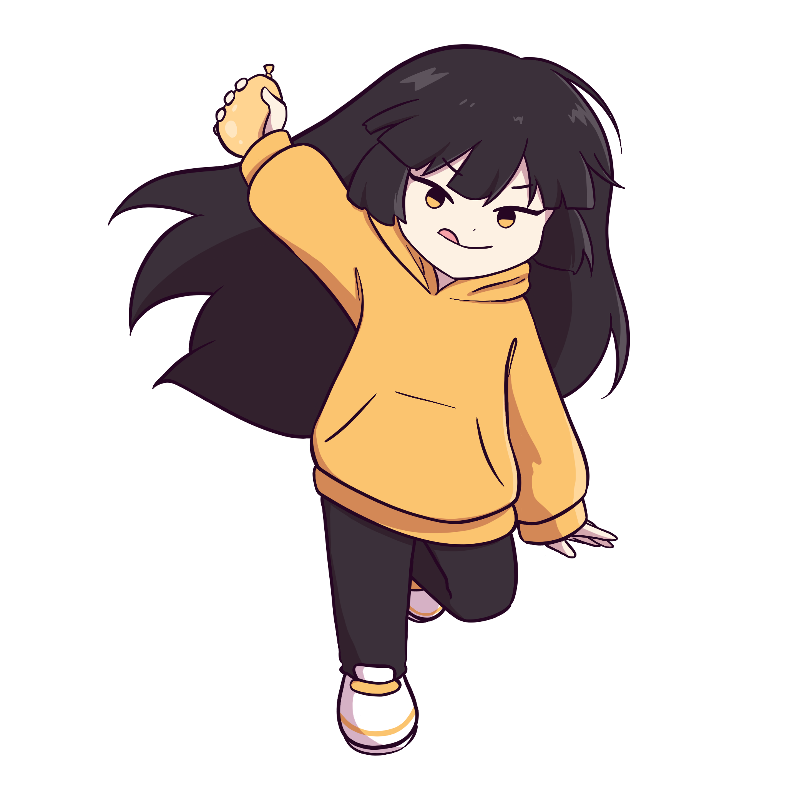
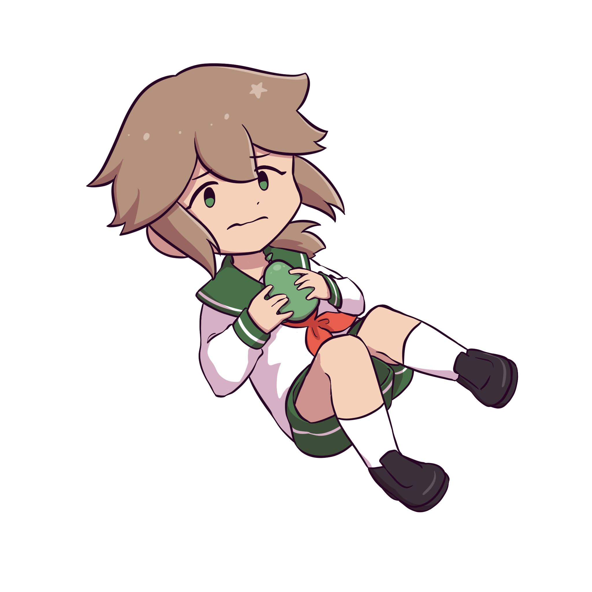
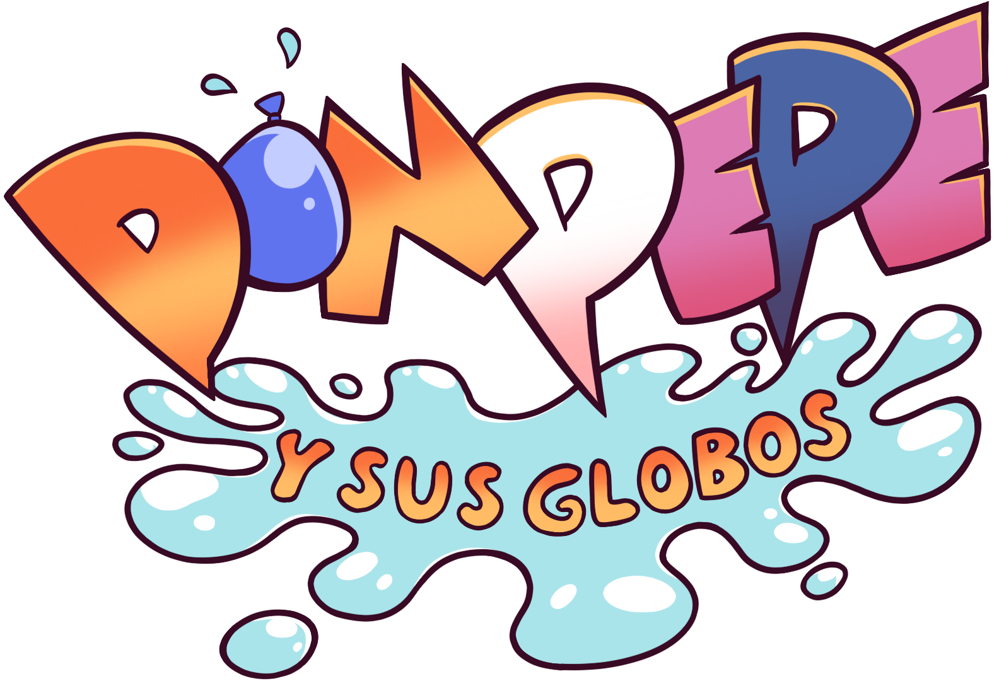

# 🌟 Welcome to **Ibis Interactive**! 🌟  
**Where adventure meets creativity!**

  

### 🕹️ About Us 
We are **Ibis Interactive**, an adventurous game development studio passionate about creating immersive and captivating experiences. Our mascot, the bold and curious **bandurria**, symbolizes our spirit: colorful, creative, and ready to take flight!

### 🎮 Current Project  
Stay tuned for _**[Don Pepe y sus globos](https://store.steampowered.com/app/4079810/Don_Pepe_y_sus_globos/)**_, our latest adventure! 🚀  
>*After recalling his tragic and violent past, Don Pepe came up with a million-dollar idea: channeling that violence into... water balloons!
Don Pepe's grand water balloon tournament has gathered the most skilled fighters in the neighborhood, who will fill and throw their water balloons until only one remains dry. Who will emerge victorious?*

---

### 🛠️ Tools of the Trade  
Our creative journey is powered by: 
- ⚙️  **Unity**,  **Git**,  **VS Code**  
- 🎨  **Blender**,  **Procreate**
- 🎵  **Ableton Live**,  **Wwise**

---

### 🖼️ Sneak Peek  

  
  

  
  
  
  
  

---

### 🚀 Join Us  
We love connecting with fellow adventurers! Whether you're a developer, artist, or just a fan of games, feel free to explore our projects, give feedback, or say hello.  

  
  
  

  <em>“Take flight with Ibis Interactive – because every game is an adventure waiting to happen!”</em>

